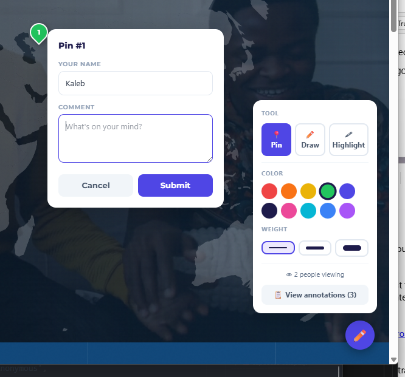

# Pindrop

**Drop-in design annotation tool for any website.**  
Leave pins, draw on the page, highlight text, and have threaded conversations — all wired to your own free Supabase database.



---

## Features

- 📍 **Pins** — click anywhere to drop a numbered pin with a comment
- ✏️ **Freehand drawing** — draw directly on the page (multi-stroke, Ctrl+Z to undo)
- 🖍️ **Text highlights** — select any text to highlight and annotate it
- 💬 **Threaded replies** — comment on any annotation
- ✏️ **Edit** — update your own comments and replies inline
- ✓ **Resolve** — mark feedback as done; resolved items collapse automatically
- 🗑️ **Delete** — anonymous ownership via localStorage token
- 🎯 **Focus mode** — click any annotation to dim everything else
- 📐 **Element anchoring** — pins reposition correctly across screen sizes
- 🔴 **Live cursors** — see other reviewers' cursors in real time
- 👁️ **Presence** — viewer count shows how many people are on the page
- 🔔 **Webhooks** — POST to any URL on new annotation or reply (Teams, Slack, Zapier…)
- 🔒 **Your data** — everything goes to your own Supabase project

---

## Setup

### 1. Create your Supabase table

Go to your [Supabase](https://supabase.com) project → SQL Editor → paste and run `supabase-setup.sql`.

### 2. Get your credentials

In Supabase: **Settings → API**
- Copy the **Project URL**
- Copy the **anon / public** key (under "Legacy anon, service_role API keys" if needed)

### 3. Add one script tag

```html
<script
  src="https://cdn.jsdelivr.net/gh/kalebheitzman/pindrop/pindrop.min.js"
  data-supabase-url="https://YOUR_PROJECT_ID.supabase.co"
  data-supabase-key="eyJ..."
  defer
></script>
```

That's it. A ✏️ button appears in the bottom-right corner.

---

## Options

| Attribute | Default | Description |
|-----------|---------|-------------|
| `data-supabase-url` | *(required)* | Your Supabase project URL |
| `data-supabase-key` | *(required)* | Your Supabase anon/public key |
| `data-page-key` | `window.location.pathname` | Custom identifier for this page |
| `data-position` | `bottom-right` | Toggle button corner: `bottom-right` or `bottom-left` |
| `data-webhook-url` | *(none)* | URL to POST to on new annotation or reply |

---

## Webhooks

Add `data-webhook-url` to your script tag and Pindrop will POST a JSON payload to that URL whenever an annotation or reply is created. Works with Microsoft Teams (Power Automate), Slack, Discord, Zapier, Make, n8n, or any endpoint that accepts a POST.

**Annotation payload:**
```json
{
  "event": "annotation.created",
  "page_url": "/some/path",
  "annotation": { "id": "...", "type": "pin", "comment": "...", "author_name": "...", ... }
}
```

**Reply payload:**
```json
{
  "event": "reply.created",
  "page_url": "/some/path",
  "annotation_id": "...",
  "reply": { "id": "...", "comment": "...", "author_name": "...", ... }
}
```

---

## How it works

Pindrop is a single self-contained JavaScript file with no build step and no framework dependencies. It lazy-loads the Supabase JS client from jsDelivr, then wires everything up — toolbar, canvas overlay, SVG layer, sidebar — entirely in vanilla JS.

**Anonymous ownership** — on first visit a random token is generated and stored in `localStorage`. This token is saved with every annotation you create, and the Delete button only appears on annotations that match your token.

**Element anchoring** — pins store a CSS selector path to the DOM element they were placed on, plus a percentage offset within that element. On resize or reload, the pin repositions itself relative to the element rather than using absolute pixel coordinates.

---

## License

MIT + Commons Clause — free to use on any project, but you may not sell Pindrop or a product whose value derives substantially from it.
